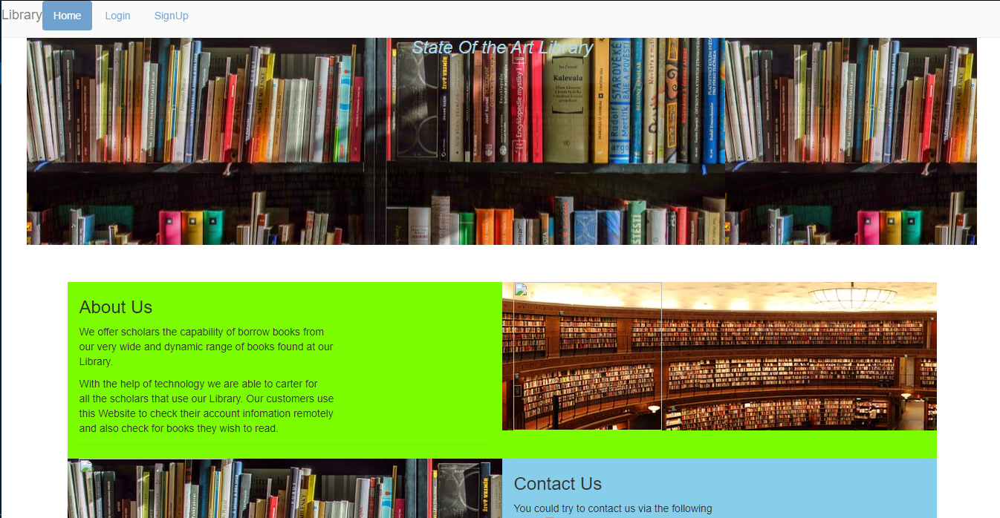

Library Management System

This was a class project assignment that we were suppossed to create a basic software that would assists in a Software design models.

The Library management software I created had an admin console which by the admin had the following capabilities.
  1.Add a stock of books.
  2.See if a book has been borrowed and by whom.
The person borrowing the book could be able to do the following.
  1.Login to his or her account on the website.
  2.See which books he/she has borrowed.

The project used Pyhton for the admin panel and PHP,HTML and CSS for the person borrowing a book.The reason for this type of build was to enhance security to the database since I never wanted to have an admin panel on the site which to me seemed very vulnerable to an attack.

Here are some of the User interface images
Home page for the users to access their books

